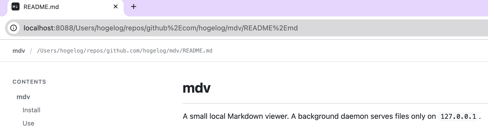

# mdv

A Ruby gem for viewing local Markdown files. It uses the well-tested `commonmarker` library for CommonMark/GitHub Flavored Markdown rendering; the background daemon serves files only on `127.0.0.1`.



## Install

Install:

```sh
rake install
```

For development:

```sh
rake test
rake build
```

## Use

```sh
mdv README.md          # start the daemon if needed and open the file
mdv                    # open the recently-viewed page
mdv --start            # explicitly start the daemon
mdv --stop             # stop it
mdv --start --port 9000
```

The default URL is <http://localhost:8088/>. Markdown files explicitly opened through the CLI are mapped to absolute URLs, for example:

```text
http://localhost:8088/Users/me/project/README.md
```

If the requested port is already in use, mdv automatically tries each following port (for example, `8088`, then `8089`).

Other Markdown files are not served until they have been opened through the CLI. Images below an opened document's directory are available so that relative image references continue to work. Raw HTML is sanitized, and responses use a restrictive Content Security Policy.

History, authorized file paths, and daemon metadata are stored in `~/.config/mdv`, or in `$XDG_CONFIG_HOME/mdv` when `XDG_CONFIG_HOME` is set.
